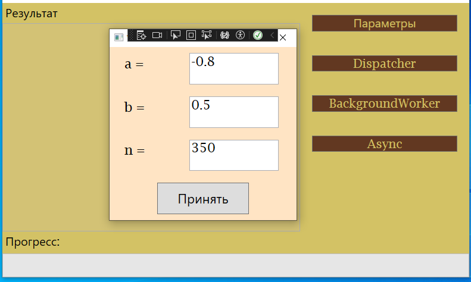

**ЛАБОРАТОРНАЯ РАБОТА №6**
**Разработка многопоточных приложений с графическим интерфейсом**

**1  Цель работы**

Освоить принципы взаимодействия с элементами графического интерфейса в многопоточном приложении.

**2  Постановка задачи**

Разработать приложение для вычисления интеграла по методу прямоугольников:


Поместить алгоритм вычеслиния интеграла в отдельной поток приложения. В главном окне при помощи элемента ProgressBar отображать ход выполнения процесса вычесления. Верхней и нижний предел интегрирования, а также число разбиений области интегрирования N вводить в отдельном диалоговом окне.

Для запуска процесса вычисления предусмотреть две кнопки. Одна кнопка должна реализовать поставленную задачу с помощью обьекта Dispatcher, вторая кнопка - с помощью компонента System.ComponentModel.BackgroundWorker.

Во время вычисления интеграла обе кнопки должны быть недоступны.

**3 Индивидуальные задания**


**4 Рекомендации к выполнению задания**

4.1 Использование DispatcherObject

Запуск вычисления в отдельном потоке


Реализация метода Calculate:


Если доступен .NET версии 4.5 и выше, можно реализовать асинхронные операции следующим образом:


Реализация метода CalculateAsync:

```
private Task CalculateAsync() {

    var step = Math.Round ((double) (n/100));
    
    return Task.Run( () =>
    {
        for (int i=0; i<=n; i++)
        {
            ... Здесь поместите код вычисления интеграла
            if(i % step == 0)
            {
                Dispatcher.BeginInvoke( DispatcherPriority.Normal,
                    new Action(() => pBar.Value = i/step));
            }
        }
    });
}
 ```


В коде окна подключите пространство имен System.ComponentModel, опишите переменнную типа BackgroundWorker и в конструкторе окна проинициализируйте ее данными из ресурса окна:

BackgroundWorker backgroundWorker;
```
public MainWindow()
{
    InitializeConponent();
    backgroundWorker = (BackgroundWorker) this.Resources["worker"];
}
```

В обработчик события backgroundWorker_DoWork поместите код вычисления интеграла. Внутри кода нужно сгенерировать событие ProgressChanged для управления элементом ProgressBar. Для этого используется метод backgroundWorker.ReportProgress(int progress):


В обработчик события backgroundWorker_ProgressChanged поместите код, управляющий показаниями элемента ProgressBar. Используйте свойство аргумента события e.ProgressPercentage.

В обрабобтчике события нажатия кнопки запуска вычисления сделайте кнопки запуска недоступными и запустите backgroundWorker с помощью функции backgroundWorker.RunWorkerAsync();

В обработчике события BackgroundWorker_RunWorkerCompleted разрешите использование кнопок запуска вычисления.

4.2 Использование BackgroundWorker

В разметке окна подключите пространство имен System.ComponentModel и добавьте ресурс BackgroundWorker:


4.3 Использование асинхронного стрима 

- Начиная с версии C# 8.0 в C# были добавлены асинхронные стримы, которые  упрощают  работу  с  потоками  данных  в  асинхронном режиме. Хотя асинхронность в C# существует уже довольно давно, тем не менее асинхронные методы до сих пор позволяли получать один объект, когда асинхронная операция была готова предоставить результат.  Для  возвращения  нескольких  значений  в  C#  могут применяться  итераторы,  но  они  имеют  синхронную  природу, блокируют  вызывающий  поток  и  не  могут  использоваться  в асинхронном контексте. Асинхронные стримы обходят эту проблему, позволяя  получать  множество  значений  и  возвращать  их  по  мере готовности в асинхронном режиме. 

По сути асинхронный стрим представляет метод, который обладает тремя характеристиками: 

- метод имеет модификатор async; 
- метод возращает объект IAsyncEnumerable\<T\>. Интерфейс IAsyncEnumerable определяет метод GetAsyncEnumerator, который возвращает IAsyncEnumerator; 
- метод содержит выражения yield return для последовательного получения элементов из асинхронного стрима. 

В этом случае метод вычисления интеграла можно добавить в сам класс Integral. Для возвращения одного значения (текущего значения интеграла) достаточно параметра <double> 
```
public async IAsyncEnumerable<double> GetDoublesAsync() { 

    … 
    
    await Task.Delay(100); yield return (S); 
    
    }; 

}
``` 

Вызов этой функции из главного окна 
```
private async void ButtonA\_Click(object sender, RoutedEventArgs e) { 

    … 
    
    IAsyncEnumerable<double> data = integral.GetDoublesAsync(); 
    await foreach (var d in data)     
    { 
    
    listBox.Items.Add($"S = {d:0.00000}"); 
    
    } 

}
```

Если же мы хотим получить дополнительные параметры – значение x и процент прогресса, можно использовать кортеж (double, double, double). 
```
public async IAsyncEnumerable<(double,double,double)> GetDoublesAsync()
{ 

    … 
    
    await Task.Delay(100);
    
    yield return (x,S,(double)i/N); 
    
    }; 

} 
```
и в главном окне: 
```
IAsyncEnumerable<(double, double, double)> data = integral.GetDoublesAsync();
await foreach (var trio in data) 
{ 

listBox.Items.Add($"x = {trio.Item1:0.00} S = {trio.Item2:0.00000}"); pBar.Value = trio.Item3 \* 100;

} 
```

Результаты лабораторные работы:

При нажатии на кнопку "Параметры" у пользователя всплывает вспомогательное окно с помощью которого пользователь может выбрать диапозон расчета интеграла [a,b] и число разбиений при этом.



Далее при нажатии на отсальные кнопки пользователь получается расчет интеграла синхронно и асинхронно, с помощью метода прямоугольников:


